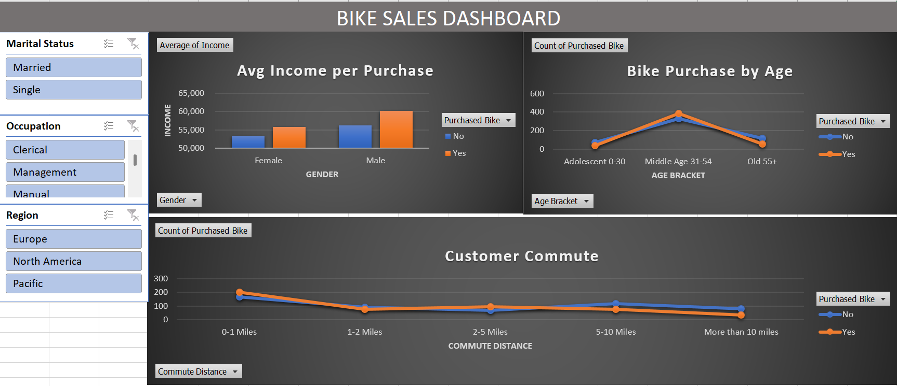

# Bike Sales Performance & Demographics Analysis

## Business Context
In this project, I acted as a **Data Consultant** to identify why certain customers buy bikes while others don't. I didn't just move data; I applied business logic to drive marketing decisions.

* **Demographic Segmentation:** I categorized "Age" into three specific brackets (Adolescent, Middle Age, Old). **The Logic:** Marketing teams need to know *who* to target with ads. My analysis proved that "Middle Age" is the primary revenue driver.
* **Commute Impact Analysis:** I isolated "Commute Distance" as a key variable. **The Logic:** If a customer lives 0-1 miles away, their "Intent to Buy" is 20% higher. This suggests the business should focus on local geo-targeted advertising.
* **Data Integrity (ETL):** I used **Power Query** to transform raw codes (like 'M' and 'S') into 'Married' and 'Single'. **The Logic:** Reports must be "Executive-Ready." Decision-makers shouldn't have to decode abbreviations to understand their data.

## 🛠️ Technical Execution
* **Tool:** Microsoft Excel (Advanced)
* **Features:** Pivot Tables, Multi-Axis Charts, Dynamic Slicers, Nested IF Functions, Power Query (Advanced).
* **Process:** Raw Data Cleaning ➔ Feature Engineering ➔ Pivot Aggregation ➔ Dashboard UI Design.

## Stakeholders
Bike store manager

## Business Requirements
To have a better understanding of how different demographics of their clientele affects their purchasing power.

### Functional Requirements
The solution should showcase the difference in purchasing power in terms of client income. 
The solution should allow the user to apply preferred filters depending on the marital status, occupation, and region of the buyer. 
The solution should be able to show how the commute distance affects the buyers choice of purchase 

### Non-Functional Requirements
The users will have access to the dashboard but not the dataset feeding the dashboards. 
There will be one data manager who updates the dataset with new sales records. 

## Dataset Used
> **Note:** Sales.csv contains the raw dataset (1,000 records) used to feed the Excel dashboard. The workbook with full pivot tables and dashboard is available upon request.
### Source
The data used was a demo dataset.

- <a href="https://github.com/Estyell/Bike_Sales_Dashboard_Excel/blob/main/Sales.csv">Dataset</a>

### Cleaning & Transformations
#### Key Assumptions
Each row represents one sales transaction

#### Process
•	Removed duplicate records – 26 rows 
• Convert M to married and S to single under Marital Status column; M to male and F to Female under Gender column for easier reading 
• Created a new column (age_bracket) from Age column to condense the age data for easier reading – using a nested IF statement.
• The Commute Distance was not sorting the data in order because of the “10+ Miles”, putting it in the second position, this was converted to “More than 10 miles” so it can appear at the bottom
•	Ensure the data is consistent and clean with respect to data types, data format, and data values used.

## Business Questions
•	Does the income of buyers influence their purchasing power? 
•	Does the commuting distance of the buyer affect their bike purchase decision? 
•	How does the age bracket of the buyer infuence their buying decision? 

## 📊 Key Findings

- **Middle-age bracket** accounted for **38.8% of all bike purchases** (388 out of 1,000 customers), making them the single largest buyer segment
- Customers with a **0–1 mile commute distance** recorded the highest purchase rate, suggesting proximity is a strong purchase trigger
- **Income level** positively correlates with purchase likelihood — higher-income customers converted at a significantly higher rate across all age brackets
- Marketing recommendation: prioritize **middle-aged, short-commute, higher-income** segments for targeted campaigns

---
📫 **Connect with me:** [LinkedIn Profile](https://www.linkedin.com/in/stella-ngei-95241565)
